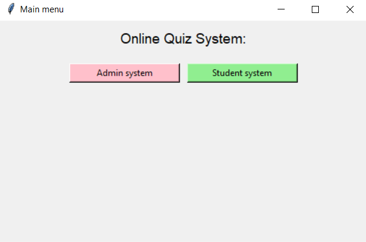

# 🧠 Online Quiz System

An interactive web application that allows students to take quizzes and administrators to manage questions and track performance. Built using PHP, MySQL, HTML, CSS, and JavaScript.

## 📌 Features

- 🧑‍🎓 Student login and quiz participation
- 🧑‍💼 Admin panel for managing questions and results
- ⏱️ Timed quizzes with automatic submission
- 📊 Result tracking and feedback
- 🔐 Secure login system
- 🧩 Question categorization by subject or topic

## 📂 Project Structure

```
Online-Quiz-System/
├── admin/             # Admin dashboard & question management
├── student/           # Student-facing quiz pages
├── css/               # Stylesheets
├── js/                # JavaScript logic
├── includes/          # Reusable PHP components
├── img/               # Image assets
├── db.php             # Database connection file
├── index.php          # Login page
├── dashboard.php      # Main dashboard
├── quiz.php           # Quiz interface
├── result.php         # Quiz results page
```

## 🛠️ Installation

1. **Clone the repository**
   ```bash
   git clone https://github.com/josephadel25/Online-Quiz-System.git
   ```

2. **Set up your local server**
   - Place the project in your `htdocs/` (XAMPP) or equivalent directory.
   - Start Apache and MySQL.

3. **Create the database**
   - Open phpMyAdmin.
   - Create a new database (e.g., `quiz_db`).
   - Import the SQL file if provided.

4. **Configure the database connection**
   - Edit `db.php` with your database credentials.

5. **Run the application**
   - Visit: `http://localhost/Online-Quiz-System/`

## 📸 Screenshots

> *(Add screenshots to `img/screenshots/` and reference them here.)*

### 🔐 Home Page



## 🧪 Technologies Used

- PHP
- MySQL
- HTML/CSS
- JavaScript

## 🤝 Contribution

Contributions are welcome!

1. Fork the repository
2. Create your feature branch:
   ```bash
   git checkout -b feature/my-feature
   ```
3. Commit your changes:
   ```bash
   git commit -m "Add my feature"
   ```
4. Push and open a pull request

## 📄 License

This project is open source and available under the MIT License.

## 📬 Contact

Created by [@josephadel25](https://github.com/josephadel25)
